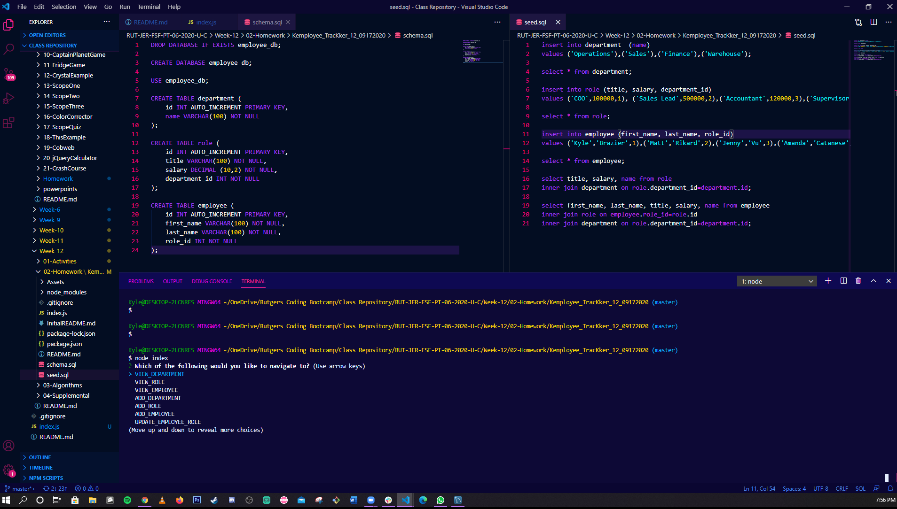

# Kemployee TracKker 12

## Table of Contents

[Description](#Description)

[Installation](#Installation)

[Usage](#Usage)

[Licenses](#Licenses)

[Contributors](#Contributors)

[Tests](#Tests)

[Questions](#Questions)

[Link](#Link)

[Screenshots](#Screenshots)

## Description

For this assignment, we were tasked with creating a command-line application that allows the user to add/view/update/delete departments/roles/employees.

## Installation

Extract files from Github.

## Usage

Initialize using "nodex index.js" in terminal.

## Licenses

N/A

## Contributors

Kyle Brazier

## Tests

Test captured and uploaded via YouTube.

## Questions

You may reach me at kylebrazier@gmail.com for further questions.

## Link

https://youtu.be/UqUDyFImqdU

## Screenshots

.png)

